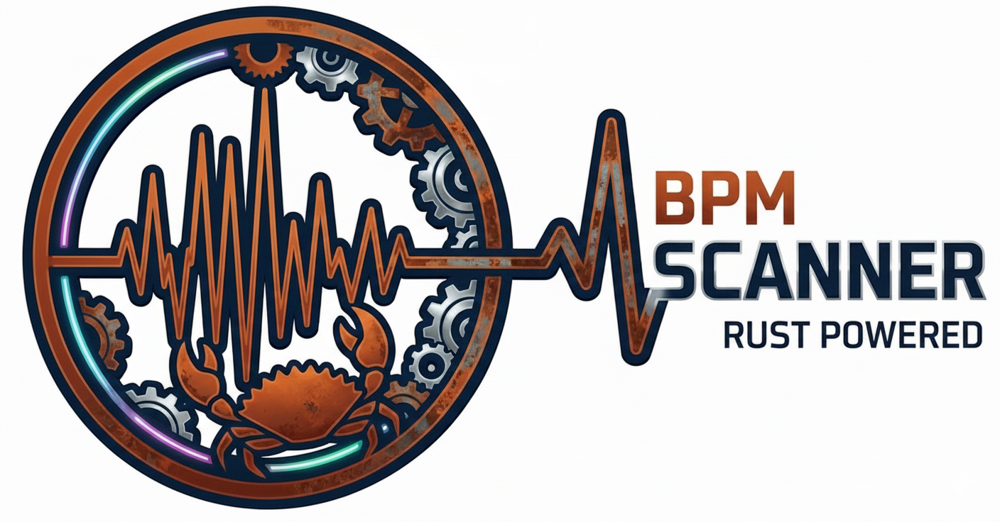

# Rust BPM Analyzer

<p align="center">
  
</p>

A real-time BPM analyzer and Ableton Link synchronization tool written in Rust.


## Overview

Rust BPM Analyzer listens to audio input (microphone or loopback), detects the tempo (BPM) in real-time, and synchronizes it with other music software using **Ableton Link**.

It is designed to be lightweight, fast, and cross-platform, running on desktop (macOS, Windows, Linux) and embedded Linux devices (Raspberry Pi, Milk-V Duo).

## Features

*   **Real-time BPM Detection**: Uses energy-based algorithms to detect tempo from audio input.
*   **Ableton Link Support**: Automatically syncs the detected tempo and beat phase with Ableton Live, Traktor, Serato, and other Link-enabled apps.
*   **"Drop" Detection**: Detects sudden energy drops and re-syncs the downbeat automatically.

---

## 🖥️ Desktop (GUI)

Designed for macOS, Windows, and Linux (x86_64). It features a modern interface built with `iced`.

### Installation

#### Download Binaries
Check the [Releases](https://github.com/YOUR_USERNAME/rust-bpm-analyzer/releases) page for the latest pre-compiled binaries:
*   **macOS**: `.dmg` (Universal/Apple Silicon)
*   **Windows**: `.exe` installer
*   **Linux**: `.deb` or `.AppImage`

# Rust BPM Analyzer


A real-time BPM analyzer and Ableton Link synchronization tool written in Rust.

This repository contains both a desktop GUI and a headless (embedded) mode intended for Linux systems.

## Overview

Rust BPM Analyzer listens to audio input (microphone or loopback), detects tempo (BPM) in real-time, and synchronizes it with other music software using Ableton Link.

Key capabilities:

- Real-time BPM detection from audio input
- Ableton Link integration for tempo and phase synchronization
- Headless mode for embedded Linux devices with ALSA control and automatic hardware gain management

---

## Desktop (GUI)

The GUI is implemented with `iced` and targets macOS, Windows, and Linux (x86_64).

### Build & Run (desktop)

Ensure you have Rust installed via `rustup`. On Linux, ensure `pkg-config` is installed (ALSA libraries are provided by the toolchain):

```bash
sudo apt update
sudo apt install pkg-config
```

Build and run (debug):

```bash
cargo run
```

Build release:

```bash
cargo build --release
```

---

## Headless / Embedded (Linux)

Headless mode runs without a GUI and is intended for Linux systems. For development and CI we assume a standard x86_64 Linux machine is available to build and test; the produced binary can be deployed to the embedded target.

### Prerequisites (build host)

- `rustup` and `cargo`
- `pkg-config` (required by `alsa-sys`). ALSA libraries and headers are provided by the toolchain, no extra system package required.

If you rely on the repository-provided toolchain (located in the `host-tools` submodule), initialize or update the submodule before building:

```bash
git submodule update --init --recursive
# If the submodule is tracked to a remote branch and you want the latest:
git submodule update --remote --init --recursive
```

Install on Debian/Ubuntu (if `pkg-config` is missing on your build host):

```bash
sudo apt update
sudo apt install pkg-config build-essential
```

### Build on x86_64 Linux (recommended)

You can build the release binary directly on an x86_64 Linux machine — no cross toolchain required for the supported workflow:

```bash
cargo build --release --target aarch64-unknown-linux-gnu
```

The release binary will be at `target/release/rust-bpm-analyzer`.

### Conditional dependencies in `Cargo.toml`

To avoid compiling ALSA-specific crates on desktop platforms, keep ALSA and GPIO dependencies behind a target cfg in `Cargo.toml`:

```toml
[target.'cfg(all(any(target_arch = "aarch64", target_arch = "arm"), target_os = "linux"))'.dependencies]
alsa = "0.9.0"
gpio-cdev = "0.6.0"
```

This ensures these crates are only built for ARM Linux targets.

### Deploy to the target

Copy the binary and run on the target (example):

```bash
scp target/release/rust-bpm-analyzer user@target:/home/user/
ssh user@target
chmod +x /home/user/rust-bpm-analyzer
./rust-bpm-analyzer
```


### ALSA checks and utilities

On the target, verify ALSA controls with `amixer` / `alsamixer`:

```bash
amixer controls
amixer sget Capture
amixer sset Capture 50%
alsamixer
```

If `pkg-config` is missing in your CI environment, `alsa-sys` will fail to build — run ALSA builds on Linux runners.

## Troubleshooting

- `pkg-config not found`: install `pkg-config` on the build host or CI runner.
- `No capture Selem found`: verify the audio device provides capture controls (`amixer controls`) and try alternate device names like `hw:0` or `plughw:0`.
- ALSA on Windows: ALSA is Linux-only. Build ALSA-enabled artifacts on Linux runners and skip ALSA on Windows builds.

## Project structure

- `src/core_bpm/`: Audio capture and BPM analysis logic
- `src/network_sync/`: Ableton Link integration
- `src/gui.rs`: GUI (desktop only)
- `src/embeded.rs`: Headless entry (Linux only)
- `assets/`: Icons, build scripts

## License

This project is licensed under a **Non-Commercial License**.

You are free to:
*   **Use** the software for personal or non-profit purposes.
*   **Modify** the source code for your own non-commercial use.
*   **Redistribute** the software for free.

You may **NOT**:
*   Use this software for commercial purposes (business, paid services, etc.).
*   Sell this software or any derivative works.

See the [LICENSE](LICENSE) file for the full legal text.
